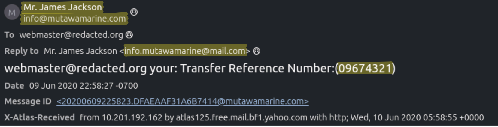
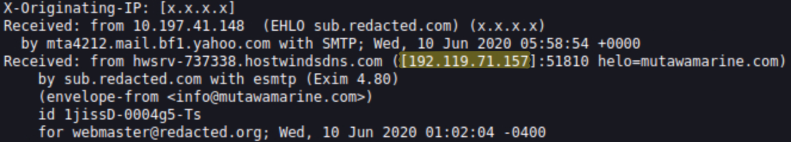
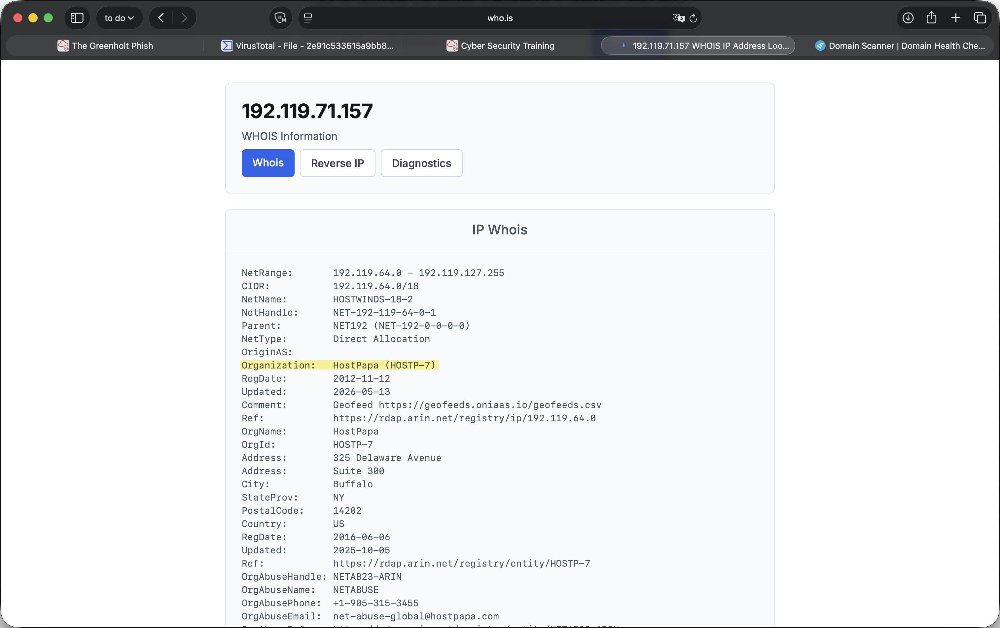
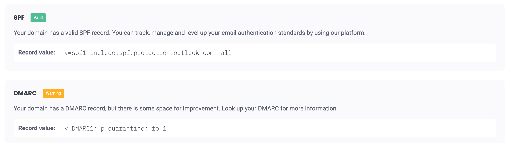
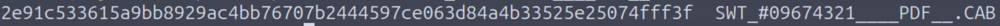
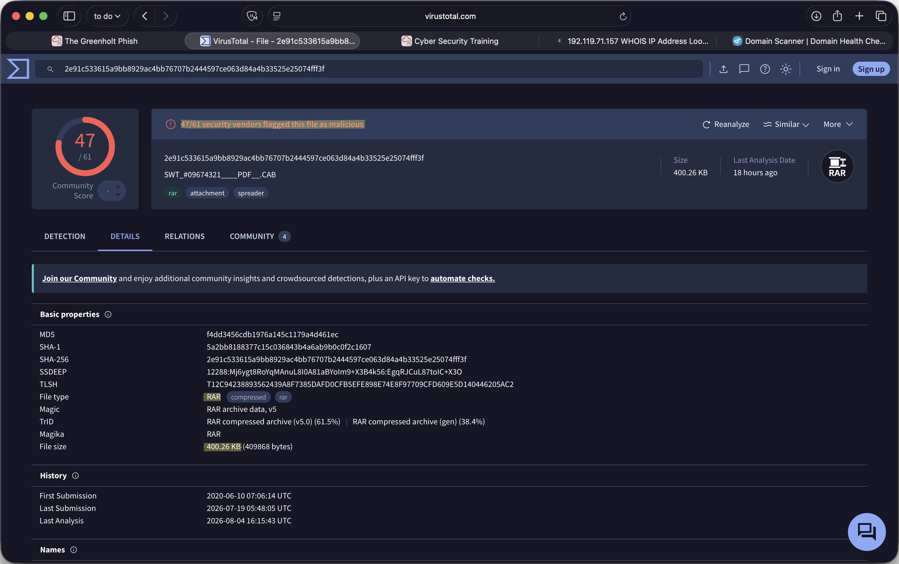

# The Greenholt Phish — Write-Up

> **Category:** Phishing / email analysis · SOC Level 1
> **Difficulty:** Easy
> *Author:** Shoham Houta
> **Date:** 2026-08-05

---

## Summary

A sales employee at Greenholt PLC received what looked like a payment transfer confirmation from a marine services company, with a "PDF" attached. The room hands you the raw message and twelve questions, and the questions are structured deliberately: each one pushes you down a different analysis route — subject and sender parsing, reply-path inspection, header hop tracing, IP attribution, DNS authentication records, and finally attachment triage.

Answering all twelve produces a complete triage verdict. The message fails on three independent axes: it originates from a HostPapa IP that the sender domain's own SPF record explicitly does not authorize, the `Reply-To` diverts replies to a free `mail.com` mailbox, and the attachment is a RAR archive dressed up as a PDF via a `.CAB` extension.

**Verdict: malicious — phishing with a malware-bearing attachment, sent under a spoofed corporate identity.**

**Tools used:** raw header inspection, EasyDMARC (header analyzer and SPF/DMARC lookup), who.is (WHOIS), VirusTotal (file reputation), `sha256sum`.

**Handling note:** the attachment was never extracted or executed. Hash and metadata only.

Each section below follows the same shape — the artifact examined, the method applied to it, and the finding that came out.

---

## Q1 — What is the Transfer Reference Number listed in the email's Subject line?

**Artifact:** message subject line
**Method:** direct read of the header block
**Finding:** `09674321`

The reference number is the social-engineering hook. Framing the mail as confirmation of a transfer *already sent* pressures the recipient into opening the receipt before questioning the sender — they believe the transaction has happened and want the details.

Worth carrying forward: these same digits reappear inside the attachment filename. The lure and the payload are tied together, which makes the reference number a usable retro-hunt string across the mail gateway later.



---

## Q2 — What is the display name of the sender?

**Artifact:** `From` header, human-facing half
**Method:** direct read of the header block (same capture as Q1)
**Finding:** `Mr. James Jackson`

The display name is spelled cleanly and reads as a plausible business contact — which is the point. It is the *only* part of the sender identity most users actually read, and it is a free-text field with no enforced relationship to the address behind it. An attacker can put any string there, so a well-formed display name carries no assurance whatsoever.

---

## Q3 — What is the sender email address?

**Artifact:** `From` header, machine-facing half
**Method:** direct read of the header block
**Finding:** `info@mutawamarine.com`

This is a real marine services company's domain. Important framing for later: that organization is a *victim* of the impersonation here, not the attacker. The distinction changes what you're allowed to block once Q7 and Q8 confirm the spoofing.

---

## Q4 — What email address will receive a reply to this email?

**Artifact:** `Reply-To` header
**Method:** direct read of the header block, compared against the `From` address on the adjacent line
**Finding:** `info.mutawamarine@mail.com`

This is the highest-value single indicator in the message, and the reason the question exists separately from Q3.

The `From` domain is corporate. The `Reply-To` is a free consumer mailbox that merely *contains* the corporate name as a local part. A recipient scanning the sender line sees `mutawamarine.com`; the moment they hit Reply, their message goes to `mail.com` — attacker-controlled infrastructure that stays live regardless of whether the spoofed domain is ever cleaned up.

The comparison is only possible because both fields sit in the same view. A `Reply-To` on a free mail provider, on a message claiming corporate origin, is on its own enough to justify escalation.

Three further fields in the same capture are worth recording even though the room doesn't ask about them:

- **Date:** `09 Jun 2020 22:58:27 -0700` — anchors the message in time for any retro-hunt window.
- **Message-ID:** `<20200609225823.DFAEAAF31A6B7414@mutawamarine.com>` — the domain part claims the spoofed corporate domain, consistent with the rest of the impersonation. Message-IDs are generated by the sending system and are trivially forgeable, so this corroborates the effort rather than proving anything about origin. It is still a usable IOC for correlating other messages from the same campaign.
- **`X-Atlas-Received`:** shows the message passing through `atlas125.free.mail.bf1.yahoo.com`. Read in isolation this looks like it might say something about the sender, but the `Received` chain in Q5 settles it — Yahoo is on the *receiving* side, handling mail for the recipient's organisation. It tells you about the victim's mail path, not the attacker's.

---

## Q5 — What is the originating IP address of this email?

**Artifact:** `Received` header chain
**Method:** read the chain bottom-up to isolate the earliest hop
**Finding:** `192.119.71.157`

`Received` headers stack chronologically with the earliest hop at the bottom, so the bottom entry is the closest thing to a true origin the message offers. Everything above it was added by relays that trusted whatever the sender presented.



The bottom hop carries more than the IP, and the extra detail is worth reading:

```
Received: from hwsrv-737338.hostwindsdns.com ([192.119.71.157]:51810 helo=mutawamarine.com)
    by sub.redacted.com with esmtp (Exim 4.80)
    (envelope-from <info@mutawamarine.com>)
```

Three things sit in that one hop. The connecting host's real reverse name is `hwsrv-737338.hostwindsdns.com` — generic hosting infrastructure. The `helo=` value is `mutawamarine.com`, meaning the sender *announced itself* as the corporate domain during the SMTP handshake; HELO is self-declared and unverified, so this is the impersonation happening at the protocol level rather than just in the display headers. And the envelope sender (`MAIL FROM`) matches the `From` header, which is what makes the SPF check in Q7 evaluate against `mutawamarine.com` and fail.

The hop above it is the receiving side — `sub.redacted.com` handing off to `mta4212.mail.bf1.yahoo.com`, which is the recipient organisation's mail path and tells you nothing about the attacker.

Caveat worth stating in a real report: hops below your own receiving infrastructure can be forged. This is the strongest available signal, not proof.

---

## Q6 — Who is the owner of the originating IP?

**Artifact:** the IP recovered in Q5
**Method:** WHOIS lookup on `192.119.71.157` (who.is)
**Finding:** **HostPapa** — `Organization: HostPapa (HOSTP-7)`, netblock `192.119.64.0/18`



This is the pivot point of the whole investigation. A marine logistics firm sending business correspondence would be expected to originate from its own mail infrastructure or its provider's outbound range — not from generic shared web hosting. Shared hosting appearing as the origin of "corporate" mail usually means one of two things: a compromised hosting account being abused as a relay, or infrastructure rented outright for the campaign. From the message alone you can't distinguish them, and the write-up shouldn't pretend otherwise.

One detail worth not glossing over: the registry record and the reverse DNS disagree on the name. WHOIS gives `Organization: HostPapa` with `NetName: HOSTWINDS-18-2`, while the connecting host in Q5 reverses to `hwsrv-737338.hostwindsdns.com` — Hostwinds. Two provider names for one address is normal in hosting: allocations get transferred, resold, or operated under a sibling brand, and the registry record is the authoritative one for ownership while the reverse name reflects whoever currently operates the host. For the room's purposes the answer is the WHOIS organisation. For an abuse report, the `OrgAbuseEmail` on the WHOIS record is the address you'd actually write to.

---

## Q7 — What is the full SPF record for this domain?

**Artifact:** DNS TXT records for `mutawamarine.com`
**Method:** SPF lookup via EasyDMARC
**Finding:**

```
v=spf1 include:spf.protection.outlook.com -all
```

Here is where Q5 and Q6 pay off. The domain authorizes exactly one sending source — Microsoft 365 outbound — and terminates in `-all`, a hard fail instructing receivers to reject everything else.



A HostPapa IP is emphatically not inside `spf.protection.outlook.com`. **The message fails SPF against the domain it claims to be from.** Combined with the forged `helo=mutawamarine.com` and the matching envelope sender from Q5, the spoofing is now proven rather than suspected.

EasyDMARC labels the record "Valid" — worth reading carefully. That means the syntax is well-formed and the policy is sound, not that this particular message passed. A valid record is exactly what makes the failure meaningful.

---

## Q8 — What is the complete DMARC record for this domain?

**Artifact:** DNS TXT record at `_dmarc.mutawamarine.com`
**Method:** DMARC lookup via EasyDMARC (same results page as Q7, above)
**Finding:**

```
v=DMARC1; p=quarantine; fo=1
```

EasyDMARC flags this one as "Warning" rather than "Valid" — the record is present and functional, but `p=quarantine` is one step short of `p=reject`, and there is no `rua` address configured, so the domain owner receives no aggregate reports and has no visibility into who is spoofing them.

SPF establishes that the message is unauthorized; DMARC states what receivers should *do* about it. `p=quarantine` tells them to divert failing mail rather than deliver it, and `fo=1` requests forensic reports whenever an underlying check fails.

So the impersonated domain publishes a reasonable policy. The spoofing succeeded despite the owner's configuration, not because of a gap in it.

Which raises the question a SOC analyst should carry *out* of this triage rather than leave behind: if the domain publishes `-all` and `p=quarantine`, why did this reach an inbox? Plausible answers — the receiving gateway evaluates DMARC but doesn't enforce it, an allow-list or connector bypasses evaluation, or the message arrived by a path where authentication was never assessed. Answering it needs the gateway logs, which the room doesn't provide. In a real incident it's the follow-up that prevents the next one, because a control that exists but isn't enforced fails silently every time.

---

## Q9 — What is the file name of the attachment found in the email?

**Artifact:** attachment metadata
**Method:** direct read from the message
**Finding:** `SWT_#9674321____PDF__.CAB`

The filename is doing deliberate work on two levels. It carries the Q1 reference number to reinforce the lure, and it embeds the string `PDF` padded with underscores so that a truncating mail client — or a user glancing at it — registers "PDF". The declared extension is `.CAB`, a Microsoft cabinet archive. Neither claim survives Q12.

---

## Q10 — Using the sha256sum command, what is the SHA256 hash of the file?

**Artifact:** the saved attachment
**Method:** local hashing — the one question that requires the terminal

```bash
sha256sum "SWT_#9674321____PDF__.CAB"
```

**Finding:**

```
2e91c533615a9bb8929ac4bb76707b2444597ce063d84a4b33525e25074fff3f
```



Saved without opening. The hash is the pivot into reputation analysis and the most durable IOC this triage produces — filenames and sender addresses change per campaign, the file signature doesn't.

---

## Q11 — What is the attachment's file size in KB?

**Artifact:** the SHA256 from Q10
**Method:** hash lookup on VirusTotal (file details view)
**Finding:** **400.26 KB**, alongside a detection ratio of **47/61**



Submitting the hash rather than the file matters. A hash lookup returns existing intelligence without disclosing a potentially sensitive sample to a public platform — in a corporate incident, uploading an attachment that may contain internal data is a decision to make consciously, not reflexively.

47 of 61 engines flagging it is well past the threshold where vendor disagreement or a false positive is a plausible explanation.

The details view carries three things beyond the answer. The community tags include **`spreader`**, suggesting self-propagating behavior — a hint about what detonation would reveal, not a substitute for it. The **first submission date is 2020-06-10 07:06 UTC**, hours after the message was sent on 09 Jun 2020 22:58 -0700; the sample hit public analysis while the campaign was live, which is consistent with multiple recipients receiving it in the same wave. And the record supplies **MD5 and SHA-1** alongside the SHA256, useful because some older tooling and blocklists still key on those.

---

## Q12 — What is the actual file type of the attachment?

**Artifact:** the file's magic bytes
**Method:** file-type identification via the VirusTotal file details view
**Finding:** **RAR**

The VirusTotal details view (captured above) reports `Magic: RAR archive data, v5`, with TrID and Magika independently agreeing on RAR.

The declared `.CAB` is false. By signature the file is a RAR archive — so three separate claims about this attachment (PDF in the name, CAB in the extension, "payment receipt" in the body) are all wrong, and the ground truth comes from the file signature rather than any of them.

The choice of an archive over a direct executable is itself a tell. Archives frequently pass gateways that block executables outright, and unpacking is delegated to the user, who has already been primed to expect a document.

---

## Indicators of Compromise

| Type                     | Value                                                              | Note                                                       |
| ------------------------ | ------------------------------------------------------------------ | ---------------------------------------------------------- |
| Sender address (spoofed) | `info@mutawamarine.com`                                            | Impersonated legitimate domain — see caveat below          |
| Reply-To address         | `info.mutawamarine@mail.com`                                       | Attacker-controlled — safe to block                        |
| Originating IP           | `192.119.71.157`                                                   | WHOIS org HostPapa; netblock `192.119.64.0/18`             |
| Sending host (rDNS)      | `hwsrv-737338.hostwindsdns.com`                                    | Connecting host in the earliest `Received` hop             |
| Forged HELO              | `mutawamarine.com`                                                 | Announced during SMTP handshake; self-declared, unverified |
| Message-ID               | `<20200609225823.DFAEAAF31A6B7414@mutawamarine.com>`               | Forgeable, but useful for campaign correlation             |
| Attachment filename      | `SWT_#9674321____PDF__.CAB`                                        | RAR archive by signature                                   |
| SHA256                   | `2e91c533615a9bb8929ac4bb76707b2444597ce063d84a4b33525e25074fff3f` | 400.26 KB (409,868 bytes), 47/61 detections                |
| MD5                      | `f4dd3456cdb1976a145c1179a4d461ec`                                 | For tooling that keys on MD5                               |
| SHA-1                    | `5a2bb8188377c15c036843b4a6ab9b0c0f2c1607`                         |                                                            |
| Subject keyword          | Transfer reference `09674321`                                      | Campaign-specific; useful for retro-hunting                |

**Blocking caveat:** the `From` domain belongs to a real company that is itself a victim of this impersonation. Blocking it wholesale is a business decision, not a technical one. The `Reply-To` address, the originating IP, and the file hash can all be actioned without collateral damage.

---

## Response and Detection

**Immediate containment (in a live environment):**

1. Retro-hunt the hash, the `Reply-To` address, and the reference number across the mail gateway to scope how many recipients received it.
2. Purge delivered copies; block the hash at the endpoint and the `Reply-To` at the gateway.
3. Check whether anyone replied or opened the attachment. If opened, treat the host as suspect and pull endpoint telemetry for archive extraction followed by process execution.
4. Notify the impersonated organization — they are likely being used against their own customers.

**Detection opportunities this case suggests:**

- Alert where `Reply-To` domain ≠ `From` domain and `Reply-To` resolves to a free mail provider. High signal, low volume, cheap to implement.
- Alert on inbound mail failing SPF against a domain publishing `-all` — and separately, verify the gateway *enforces* DMARC rather than only evaluating it.
- Flag attachments whose file signature disagrees with the declared extension. This catches the technique regardless of which archive format the next campaign uses.
- Flag filenames containing a document-type string (`PDF`, `DOC`, `XLS`) followed by a different real extension.

**MITRE ATT&CK mapping:**

| Technique                                  | ID        |
| ------------------------------------------ | --------- |
| Phishing: Spearphishing Attachment         | T1566.001 |
| Impersonation                              | T1656     |
| Masquerading: Masquerade File Type         | T1036.008 |
| User Execution: Malicious File (attempted) | T1204.002 |

---

## Gaps and Open Questions

- **The sample was not detonated.** Reputation lookup only — no C2 domains, dropped-file paths, or persistence mechanisms. In a real engagement the archive goes to a sandbox and the IOC list roughly triples.
- **No mail gateway logs**, so the Q8 delivery question stays unanswered and campaign scope (how many recipients, over what window) is unknown.
- **Origin attribution is bounded.** Compromised host vs. rented infrastructure is not determinable from the message.
- **`Received` headers are only as trustworthy as the relay that wrote them.**

---

## References

- [MITRE ATT&CK T1566.001 — Spearphishing Attachment](https://attack.mitre.org/techniques/T1566/001/)
- [MITRE ATT&CK T1036.008 — Masquerade File Type](https://attack.mitre.org/techniques/T1036/008/)
- [RFC 7208 — Sender Policy Framework (SPF)](https://datatracker.ietf.org/doc/html/rfc7208)
- [RFC 7489 — DMARC](https://datatracker.ietf.org/doc/html/rfc7489)
- [TryHackMe — The Greenholt Phish](https://tryhackme.com/room/phishingemails5fgjlzxc)
